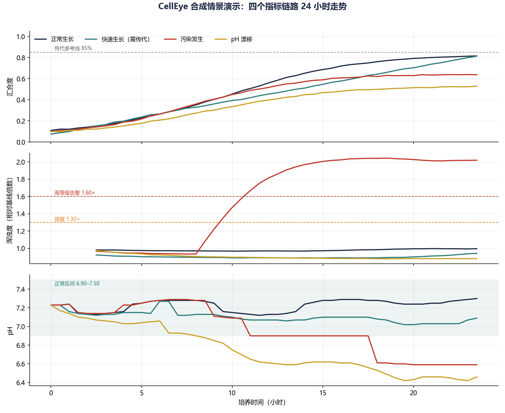
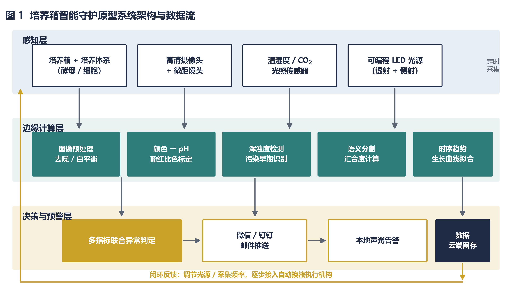

# CellEye · 细胞之眼

**面向细胞治疗产业的低成本具身智能培养监测系统**

> 给细胞培养箱装上「眼睛」和「大脑」——
> 让它自己看见细胞的状态，并在污染或 pH 偏移发生之初就主动开口预警，
> 而不是等人每天开箱看一眼。

[](#快速开始)
[](#快速开始)
[](LICENSE)

---

## 这是什么

细胞治疗（MSC 等细胞药物）的生产过程对无菌与稳定要求极高，但「感知箱内状态」的手段却非常原始：
每天人工开箱看 1～2 次，两次之间十几个小时全是盲区；而污染早期的轻微浑浊、培养基那一点点
偏向橙黄的变色，肉眼根本看不出来——等到看得出来，往往整批已经报废。
商用在线活细胞成像系统动辄数十万元，中小实验室配不起。

CellEye 想做的是：用几千元的物料，让一台普通培养箱获得基础的状态感知与异常预警能力。

本仓库是**第一阶段**的代码，目标是在桌面级条件下验证三件事：

| 目标 | 具体含义 |
|---|---|
| **看得见** | 定时自动成像，替代"人偶尔看一眼" |
| **测得准** | 从图像中定量读出汇合度、培养基 pH、浑浊度 |
| **报得早** | 在污染肉眼可见之前发出告警 |

---

## 当前状态

> 诚实是第一位的。这一节如实反映进度，不夸大。

**第 0 周（2026-09-10）：仓库建立，算法链路已在合成图像上端到端跑通。硬件尚未到货。**

| 模块 | 状态 | 说明 |
|---|---|---|
| 图像采集 | 🟡 合成模式可用 | `MockCamera` 已跑通；真机 `PiCamera` 待硬件到货后验证 |
| 环境传感器 | 🟡 合成模式可用 | SHT31 / SCD40 / BMP280 驱动已写；I2C 实机待验证 |
| 汇合度 | 🟡 阈值法可用 | Otsu 阈值法，合成图像上误差 ≤ 0.06；真实图像未验证 |
| pH 比色 | 🔴 **未标定** | 目前用演示色表，**必须**用缓冲液实测标定后才可信 |
| 浑浊度预警 | 🟡 合成模式可用 | 指标已通过三维解耦检验；真实污染未验证 |
| 语义分割模型 | ⬜ 未开始 | 预留接口，调用会显式报错而不是悄悄回退 |
| 告警推送 | 🟡 代码就绪 | 默认关闭；webhook 未联调 |
| 自动换液执行机构 | ⬜ 未开始 | 第二阶段内容 |

**已知局限（不打算藏）：**

- 汇合度用的是最朴素的全局 Otsu 阈值法。真实图像里细胞团块、焦外、光照不均都会骗它。
  它的价值在于**建立基线**——换成模型后，改进幅度才有得比。
- pH 完全依赖标定。**没做过缓冲液标定之前，任何 pH 读数都只能当演示看。**
- 浑浊度指标是在合成图像上验证的，真实培养基的光学行为（气泡、冷凝水、瓶壁反光）还没遇到。
- 全部验证目前基于合成图像。**合成图像能验证代码逻辑，不能验证物理正确性。**

---

## 快速开始

不需要任何硬件，普通笔记本即可跑通全链路。

```bash
pip install -r requirements.txt

# 端到端演示：四种情景 × 24 小时，产出对比曲线
python scripts/demo_mock.py

# 跑主流水线（默认合成模式），采集 10 帧
python -m src.pipeline -n 10

# 只跑"污染发生"情景
python -m src.pipeline -n 30 --scenario contamination

# 跑测试
pip install -r requirements-dev.txt
python -m pytest tests/ -q
```

演示会生成 `docs/figures/demo_scenarios.png`：



四条曲线分别是四种情景。注意中间那幅——只有"污染发生"情景的浑浊度冲到了基线的 2 倍，
其余三种始终平在 1.0 附近。这正是告警要抓的东西。

---

## 系统架构



- **感知层**：摄像头 + 可控 LED 光源 + 温湿度 / CO₂ 传感器
- **边缘计算层**：树莓派 5 上完成全部图像分析，不依赖云端
- **决策与预警层**：多指标联合判定 → 推送告警 → 数据留存
- **反馈回路**：动态调节采集频率与光照，并为第二阶段的执行机构预留接口

---

## 三个指标

三个指标各自独立、互不依赖，任何一个算不出来都不影响另外两个。

### 汇合度 · `src/analyze/confluence.py`

Otsu 全局阈值 + **双峰性守卫**。守卫是必需的：不加它，Otsu 一定会把暗角渐变切成两类，
空白视野也能报出 40% 汇合度。合成图像上误差 ≤ 0.06，且对浑浊度基本免疫。

### pH · `src/analyze/ph_color.py`

酚红比色法。两个关键点：

1. **同框白平衡**：画面里放一块标准白卡，用它抵消光照漂移——
   不这么做的话，昼夜光照变化会被直接误读成 pH 变化。
2. **只在亮部取色**：细胞比培养基暗，中位数直接取会把高汇合度时的
   中位色落到细胞上（实测 pH 偏 0.4）。取最亮的 30% 像素即可稳定锁定培养基。

色表由 `scripts/calibrate_ph.py` 用已知 pH 的缓冲液标定生成：

```bash
# 文件名需形如 ph_7.20_01.jpg
python scripts/calibrate_ph.py --dir data/raw/calibration --report
```

### 浑浊度 · `src/analyze/turbidity.py`

**这是迭代了四轮才定下来的指标**，过程完整记录在源码 docstring 和
[docs/log/2026-W37.md](docs/log/2026-W37.md) 里。一句话总结：

| 轮次 | 指标 | 结果 |
|---|---|---|
| 1 | 拉普拉斯方差 | ❌ 方向反了——把噪声当成了清晰 |
| 2 | 灰度标准差 | ❌ 与汇合度耦合，生长抵消污染 |
| 3 | 动态范围 p95−p5 | 🟡 汇合度解耦，但仍受 pH 干扰 34% |
| 4 | **归一化动态范围** | ✅ 浑浊 55% / 汇合 7% / pH 15% |

最终式：`clarity = (p95 − p5) / (p95 + p5)`

判据用**相对基线的倍数**而非绝对值——每台设备、每次装液的光学条件都不同，
只有和"自己最初清澈时的样子"比才有意义。

---

## 目录结构

```
CellEye/
├── src/
│   ├── config.yaml       # 全部阈值与参数（不写死在代码里）
│   ├── capture.py        # 采集 + 合成图像生成器
│   ├── sensors.py        # SHT31 / SCD40 / BMP280
│   ├── schema.py         # 数据结构
│   ├── alert.py          # 告警推送（带冷却）
│   ├── pipeline.py       # 主流水线
│   └── analyze/
│       ├── confluence.py # 汇合度
│       ├── ph_color.py   # pH 比色
│       └── turbidity.py  # 浑浊度
├── scripts/
│   ├── demo_mock.py      # 无硬件端到端演示
│   └── calibrate_ph.py   # pH 标定
├── docs/
│   ├── log/              # 每周过程记录
│   └── figures/
├── hardware/bom.md       # 物料清单
└── tests/
```

配置里的路径都是相对仓库根的，不依赖当前工作目录。

---

## 路线图

### 第一阶段（当前）· 桌面原型，模型生物验证

以**酿酒酵母**（BSL-1，安全、便宜、生长快、桌面即可完成）为模型生物验证核心原理。
这和"要造火箭先造比例模型"是同一个逻辑：用最低的代价跑通，再迁移到真正昂贵、
真正脆弱的哺乳动物细胞上。

- [x] 仓库建立，算法链路跑通（合成图像）
- [ ] 硬件到货，最小系统点亮
- [ ] 建立时序数据集
- [ ] pH 缓冲液标定
- [ ] 连续 7 天无人运行

**验收指标：** 汇合度 R² ≥ 0.95 且平均误差 ≤ 10%；污染预警早于肉眼可见 ≥ 4 小时；
pH 分级准确率 ≥ 90%；连续无人运行 ≥ 7 天；单套原型物料成本 ≤ 5000 元。

### 第二阶段 · 迁移到哺乳动物细胞

迁移到 HEK293 / CHO 及 MSC 体系，在标准细胞房场景验证；
引入 XY 滑台或小型机械臂，从"自动定点拍摄"走向"自动换液"。

### 第三阶段 · 无人化单元

多节点组网、数据上云，形成可统一调度的小型无人化培养单元。

详见 [docs/roadmap.md](docs/roadmap.md)。

---

## 过程记录

本项目遵循**完全过程导向**。成功与失败都记录，不只报喜不报忧。

- [2026-W37](docs/log/2026-W37.md) — 仓库建立；浑浊度指标四次迭代的完整复盘

---

## 硬件

物料清单见 [hardware/bom.md](hardware/bom.md)。总预算 2 万元，第一阶段约 1.1 万元。

---

## 开源

代码、电路图、3D 打印文件与标注数据集全部开源。
如果你也在做类似的事，欢迎开 issue 交流——尤其是踩过的坑。

## 致谢

本项目由**宇树科技「天才少年」无偿赞助计划**支持。

## License

[MIT](LICENSE)
