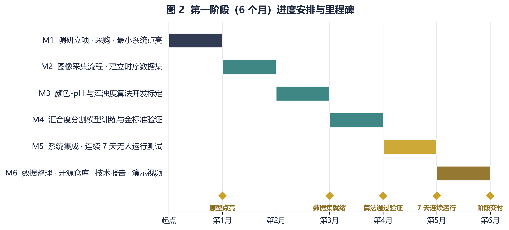

# 路线图

## 总目标

构建一套低成本（单监测点物料成本 ≤ 5000 元）、可复制、面向细胞治疗生产场景的
智能化培养监测与预警系统，最终形成「无人化细胞工厂」的基本单元。

---

## 第一阶段 · 桌面原型（当前，6 个月）

**策略：先用模型生物把核心原理跑通。**

为什么不直接上哺乳动物细胞：MSC 培养周期长（几天到两周）、培养基昂贵、
需要 CO₂ 培养箱、污染代价高（一批报废可能影响数周排期）。
用它来调试算法，迭代一次的成本太高。

改用**酿酒酵母**（*Saccharomyces cerevisiae*）：BSL-1 非致病、便宜、
对数期 2～3 小时（一天内可见明显变化）、光学特征清晰（天然浊度非常适合
验证比色与浑浊度算法）、桌面即可完成，不需要 CO₂ 培养箱。

这和"要造火箭先造比例模型"是同一个逻辑。

### 验收指标

| 指标 | 目标值 | 当前 |
|---|---|---|
| 汇合度估计与金标准相关性 | R² ≥ 0.95，平均误差 ≤ 10% | 合成图像误差 ≤ 6% |
| 污染预警提前量 | 早于肉眼可见 ≥ 4 小时 | 未验证 |
| pH 分级准确率 | ≥ 90% | 未标定 |
| 连续无人运行 | ≥ 7 天，数据完整率 ≥ 99% | 未验证 |
| 单套原型物料成本 | ≤ 5,000 元 | 预算 5,000 元 |

### 里程碑

- **M1** 调研立项、采购、点亮最小系统
- **M2** 图像采集流程、建立时序数据集
- **M3** 颜色-pH 与浑浊度算法开发标定 → 中期报告
- **M4** 汇合度分割模型训练与金标准验证
- **M5** 系统集成、连续 7 天无人运行测试
- **M6** 数据整理、开源仓库、技术报告、演示视频 → 结题报告

### 实验设计

| 组别 | 设计 | 验证目标 |
|---|---|---|
| A 正常生长组 | 标准条件培养，全程时序拍摄 | 生长曲线拟合、汇合度 / 浊度算法 |
| B 模拟污染组 | 引入非致病杂菌 | 污染预警是否早于肉眼可见 |
| C pH 偏移组 | 酸 / 碱定量滴定 | 比色法 pH 分级准确性 |
| D 密度梯度组 | 不同接种密度 | 汇合度估计的稳健性 |

**金标准对照**：血球计数板计数、分光光度计 OD₆₀₀、台式 pH 计。
所有算法输出都与金标准逐点比对。

---

## 第二阶段 · 迁移到哺乳动物细胞

- 视觉算法迁移到 HEK293 / CHO 及 MSC 体系
- 在标准细胞房场景下验证（温湿度、CO₂、冷凝水、瓶壁反光等真实干扰）
- 引入 XY 滑台或小型机械臂：从「自动定点拍摄」走向「自动换液」
- 汇合度改用轻量语义分割模型（MobileNetV3-UNet → ONNX），与阈值法做 A/B 对比

---

## 第三阶段 · 无人化培养单元

- 多监测节点组网，数据上云
- 统一调度，形成小型无人化培养单元
- 探索与机器人平台在实验室巡检场景下的结合

---

## 设计原则

1. **先把物理模型做对，再谈算法。** 见 [2026-W37 复盘](log/2026-W37.md) 中浑浊度指标的
   四次返工——两次失败都源于图像模型不对，而不是算法不够高级。
2. **阈值写在配置里，不写在代码里。** 阈值是实验参数，要靠数据反复调。
3. **每个指标独立失败。** 任何一路传感器或算法挂掉，都不能拖垮整条链路。
4. **合成图像是资产，不是权宜之计。** 真实实验每周只能拿到有限几帧，
   而合成图像可以按需生成任意参数组合，是标定与回归测试的必需品。
